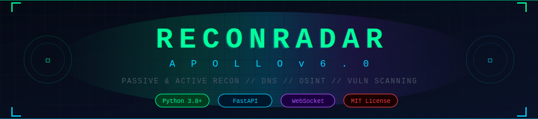
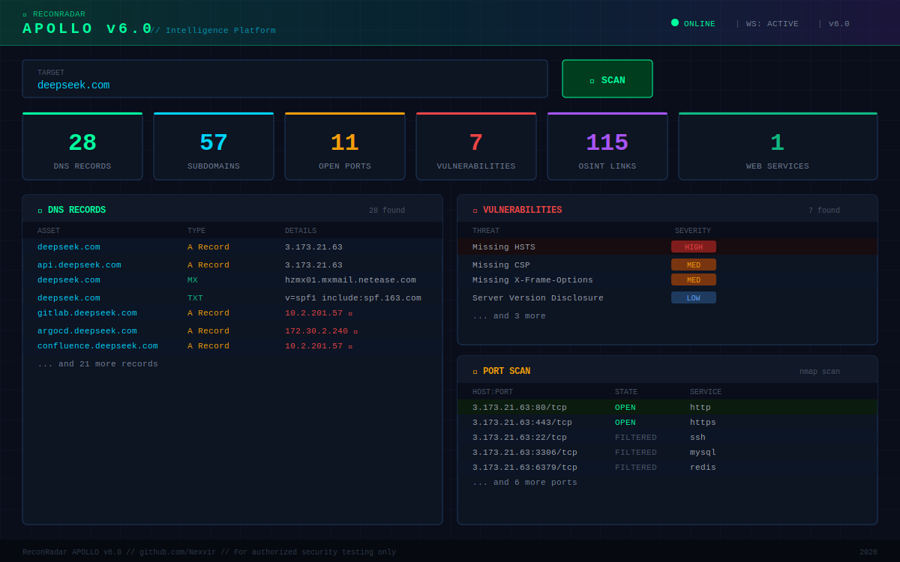
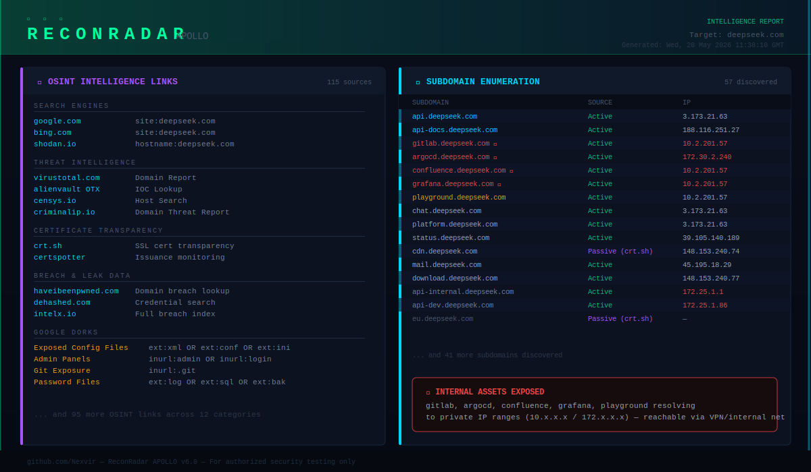
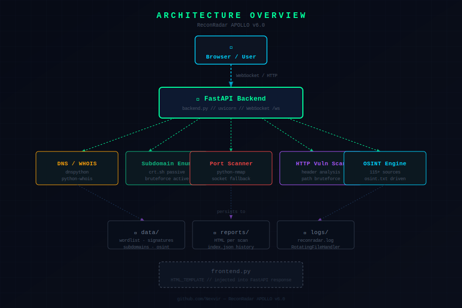

<div align="center">



# ReconRadar APOLLO v6.0

**A powerful, real-time OSINT & reconnaissance platform for authorized security professionals**

[](https://python.org)
[](https://fastapi.tiangolo.com)
[](LICENSE)
[](https://developer.mozilla.org/en-US/docs/Web/API/WebSockets_API)
[](https://nmap.org)
[](https://github.com/Nexvir)

> ⚠️ **For authorized security testing only.** Always obtain proper written permission before scanning any target.

</div>

---

## 📸 Screenshots

### Dashboard — Live Reconnaissance



*Real-time WebSocket dashboard showing DNS records, subdomain enumeration, port scan results, and vulnerability findings as they stream in.*

---

### Intelligence Report Output



*Auto-generated HTML intelligence report with OSINT links, subdomain enumeration results, and internal asset exposure warnings.*

---

### Architecture Overview



*ReconRadar's modular architecture: FastAPI backend, five recon modules, persistent storage, and rotating log system.*

---

## 🌟 Features

### 🔍 Passive Reconnaissance
- **DNS enumeration** — A, MX, TXT, NS, SOA, CNAME records via `dnspython`
- **WHOIS lookup** — with 24-hour in-memory caching to avoid rate limits
- **Certificate transparency** — passive subdomain discovery via `crt.sh`
- **Zone transfer attempts** — AXFR query against discovered nameservers
- **115+ OSINT sources** — Shodan, Censys, VirusTotal, AlienVault, Hunter.io, HaveIBeenPwned, Google Dorks, and many more

### ⚡ Active Reconnaissance
- **Subdomain brute-force** — driven by `data/subdomains.txt` wordlist with live takeover verification
- **Port scanning** — `python-nmap` with socket fallback; configurable Nmap arguments
- **HTTP probing** — detects web servers, grabs titles, headers, WAF fingerprinting
- **Vulnerability scanning** — missing security headers (HSTS, CSP, X-Frame-Options), path brute-force via `data/paths.txt`, server version disclosure

### 📊 Reporting & Storage
- **Live WebSocket stream** — every finding pushed to browser in real time
- **Auto-generated HTML reports** — saved to `reports/{scan_id}.html` after each scan
- **Scan history** — `reports/index.json` with REST endpoint `GET /history`
- **Rotating logs** — `reconradar.log` up to 10 MB × 5 backups via `RotatingFileHandler`

### 🧠 Smart Caching
- DNS results cached for **5 minutes**
- WHOIS results cached for **24 hours**
- Per-scan in-memory result buffering via `ConnectionManager`

---

## 🏗️ Architecture

```
reconradar/
├── backend.py          ← FastAPI app, all recon modules, WebSocket /ws
├── frontend.py         ← HTML_TEMPLATE (injected by backend)
├── data/
│   ├── subdomains.txt  ← Subdomain wordlist (~500 entries)
│   ├── paths.txt       ← Path brute-force wordlist
│   ├── signatures.json ← Vuln signatures (header checks, etc.)
│   └── osint.txt       ← OSINT source definitions (115+ entries)
├── reports/
│   ├── index.json      ← Scan history index
│   └── *.html          ← Per-scan intelligence reports
└── reconradar.log      ← Rotating application log
```

### Module Flow

```
Browser ──WebSocket──► FastAPI Backend
                            │
              ┌─────────────┼─────────────────────┐
              ▼             ▼             ▼         ▼        ▼
         DNS/WHOIS    Subdomain     Port Scan   HTTP Vuln  OSINT
         dnspython    crt.sh +      nmap /      headers +  osint.txt
         python-whois bruteforce    socket      paths.txt  115 links
              │             │             │         │        │
              └─────────────┴─────────────┴─────────┴────────┘
                                    │
                         reports/{id}.html  +  index.json  +  reconradar.log
```

---

## 🚀 Installation

### Prerequisites

- **Python 3.8+**
- **Nmap** installed on the system

```bash
# Ubuntu / Debian
sudo apt install nmap

# macOS (Homebrew)
brew install nmap

# Windows
# Download from https://nmap.org/download.html
```

### Step 1 — Clone the repository

```bash
git clone https://github.com/Nexvir/reconradar.git
cd reconradar
```

### Step 2 — Install Python dependencies

```bash
pip install fastapi uvicorn python-nmap dnspython python-whois httpx
```

Or install everything at once:

```bash
pip install -r requirements.txt
```

> **Note:** `httpx`, `python-nmap`, `dnspython`, and `python-whois` are gracefully optional — the tool falls back to stdlib if they're missing.

### Step 3 — Run the server

```bash
python backend.py
```

Then open your browser at:

```
http://localhost:8000
```

---

## 💻 Usage

### Basic Scan

1. Open `http://localhost:8000` in your browser
2. Enter the target domain (e.g. `example.com`)
3. Click **⚡ SCAN** — results stream live via WebSocket
4. When the scan completes, the HTML report is auto-saved to `reports/`

### Advanced Nmap Arguments

You can pass custom Nmap scan flags directly in the UI. Examples:

| Flag | Description |
|------|-------------|
| `-sV` | Service/version detection |
| `-sS` | SYN stealth scan *(requires root)* |
| `-O` | OS detection *(requires root)* |
| `-p 1-65535` | Full port range |
| `-T4` | Aggressive timing |
| `--script=default` | NSE default scripts |

### View Scan History

```
GET http://localhost:8000/history
```

Returns a JSON list of past scans. Open individual reports:

```
GET http://localhost:8000/history/{scan_id}
```

### Run as Root (full scan capabilities)

```bash
sudo python backend.py
```

Root access unlocks SYN scan (`-sS`), OS detection (`-O`), and fragmentation (`-f`) in Nmap.

---

## 🔧 Configuration

### Wordlists & Data Files

All data files are plain text / JSON and fully editable:

| File | Purpose | Format |
|------|---------|--------|
| `data/subdomains.txt` | Subdomain brute-force wordlist | One subdomain prefix per line |
| `data/paths.txt` | HTTP path brute-force | One URL path per line |
| `data/osint.txt` | OSINT sources | `NAME\|TYPE\|URL_TEMPLATE\|CONFIDENCE` |
| `data/signatures.json` | Vulnerability signatures | JSON array |
| `data/wordlist.json` | Fallback wordlist | JSON array of strings |

### Caching Tuning

Edit these constants in `backend.py`:

```python
DNS_CACHE_TTL   = 300      # 5 minutes
WHOIS_CACHE_TTL = 86400    # 24 hours
```

### Log Rotation

```python
RotatingFileHandler(
    "reconradar.log",
    maxBytes=10 * 1024 * 1024,   # 10 MB per file
    backupCount=5                 # keep 5 rotated files
)
```

---

## 📡 What ReconRadar Discovers

### DNS & WHOIS
- A, AAAA, MX, TXT, NS, SOA, CNAME records
- WHOIS registration data (registrar, dates, nameservers)
- Zone transfer (AXFR) attempt against all nameservers

### Subdomains
- **Passive** — certificate transparency logs via `crt.sh`
- **Active** — brute-force using `data/subdomains.txt` with concurrent async resolution
- **Takeover verification** — checks dangling CNAMEs against known cloud providers

### Port Scanning
Scans these ports by default (configurable):
`21, 22, 25, 80, 443, 3306, 5432, 6379, 8080, 8443, 27017`

### Vulnerability Checks
| Finding | Severity |
|---------|---------|
| Missing HSTS | 🔴 High |
| Missing CSP | 🟡 Medium |
| Missing X-Frame-Options | 🟡 Medium |
| Missing X-Content-Type-Options | 🔵 Low |
| Missing Referrer-Policy | 🔵 Low |
| Missing Permissions-Policy | 🔵 Low |
| Server version disclosure | 🔵 Low |

### OSINT Sources (115+)
Organized into 12 categories:

- 🔍 **Search Engines** — Google, Bing, DuckDuckGo, Yandex, Baidu
- 🛡️ **Threat Intelligence** — VirusTotal, AlienVault OTX, IBM X-Force, Talos, Pulsedive, GreyNoise
- 🌐 **Network Scanners** — Shodan, Censys, ZoomEye, FOFA, BinaryEdge, Netlas
- 📜 **Certificate Transparency** — crt.sh, CertSpotter, Censys Certs
- 🔑 **Breach & Leak Data** — HaveIBeenPwned, DeHashed, IntelX, LeakIX
- 🗂️ **DNS History** — SecurityTrails, ViewDNS, DNSlytics, WhoisXML
- 🕸️ **Web Archives** — Wayback Machine, CommonCrawl, CachedView
- 🛠️ **Tech Stack** — BuiltWith, Wappalyzer, WhatCMS, SimilarTech
- 📧 **Email Discovery** — Hunter.io, EmailRep
- 🎯 **Google Dorks** — Config files, passwords, admin panels, git exposure
- 📊 **Code Search** — GitHub code search, Grep.app, PublicWWW
- ⚡ **Reputation** — Google SafeBrowsing, Sucuri, McAfee SiteAdvisor, Web of Trust

---

## 🔌 API Reference

### REST Endpoints

| Method | Endpoint | Description |
|--------|----------|-------------|
| `GET` | `/` | Serves the HTML dashboard |
| `GET` | `/history` | Returns JSON list of past scan reports |
| `GET` | `/history/{scan_id}` | Serves the HTML report for a specific scan |

### WebSocket

```
ws://localhost:8000/ws
```

**Send a scan request:**
```json
{
  "target": "example.com",
  "nmap_args": "-sV -T4",
  "modules": {
    "dns": true,
    "subdomains": true,
    "ports": true,
    "http": true,
    "vulns": true,
    "osint": true
  }
}
```

**Receive messages:**
```json
{ "type": "log",    "msg": "Starting DNS enumeration..." }
{ "type": "result", "col1": "example.com", "col2": "A Record", "col3": "93.184.216.34", "severity": "Info" }
{ "type": "status", "status": "complete" }
```

---

## ⚙️ Dependencies

| Package | Purpose | Required |
|---------|---------|---------|
| `fastapi` | Web framework & REST API | ✅ |
| `uvicorn` | ASGI server | ✅ |
| `python-nmap` | Nmap Python bindings | ⚠️ Optional (falls back to socket) |
| `dnspython` | Advanced DNS queries | ⚠️ Optional (falls back to socket) |
| `python-whois` | WHOIS lookups | ⚠️ Optional |
| `httpx` | Async HTTP client | ⚠️ Optional (falls back to urllib) |
| `nmap` (binary) | Port scanning | ✅ System dependency |

---

## 🛡️ Ethical & Legal Notice

> **ReconRadar is a professional security tool. Use it responsibly.**

- ✅ Use only on systems you **own** or have **explicit written permission** to test
- ✅ Respect rate limits and terms of service of third-party OSINT sources
- ❌ Do **not** use for unauthorized reconnaissance, surveillance, or attacks
- ❌ Do **not** use against production systems without a signed scope agreement

The author assumes **no liability** for misuse. This tool is provided for authorized penetration testing, bug bounty hunting, and security research only.

---

## 🗺️ Roadmap

- [ ] Module toggle UI — enable/disable individual recon modules per scan
- [ ] Export reports as PDF
- [ ] API key management for paid OSINT sources (Shodan, SecurityTrails)
- [ ] Scheduled / cron-based recurring scans
- [ ] Docker containerization
- [ ] Slack / Discord alert webhooks on high-severity findings
- [ ] Subdomain takeover auto-exploitation (PoC only, gated behind confirm)
- [ ] IPv6 support

---

## 🤝 Contributing

Pull requests are welcome! For major changes, please open an issue first.

```bash
# Fork & clone
git clone https://github.com/Nexvir/reconradar.git
cd reconradar

# Create a feature branch
git checkout -b feature/my-new-module

# Commit & push
git commit -m "feat: add my new recon module"
git push origin feature/my-new-module

# Open a Pull Request on GitHub
```

---

## 📄 License

This project is licensed under the **MIT License** — see [LICENSE](LICENSE) for details.

---

<div align="center">

Made with ⚡ by [**Nexvir**](https://github.com/Nexvir)

*Star ⭐ the repo if you find it useful!*

</div>
